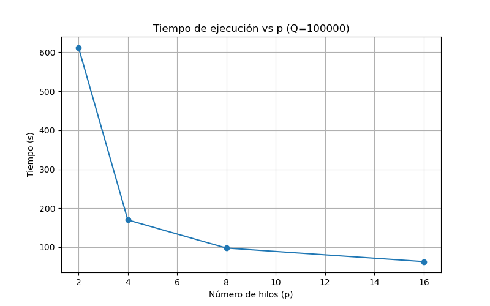
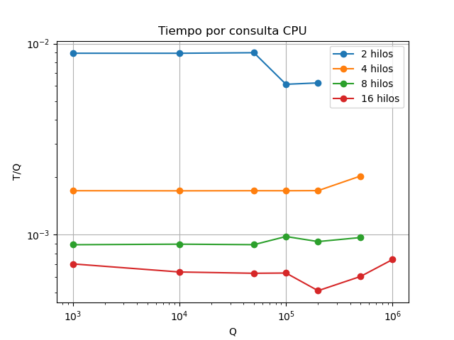
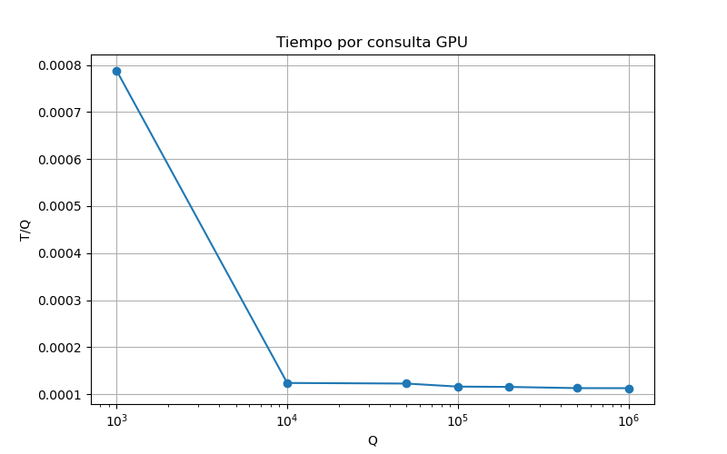
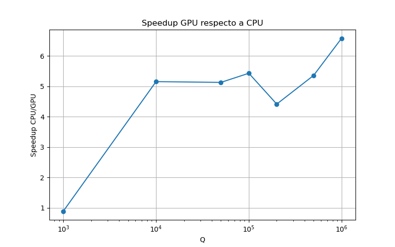
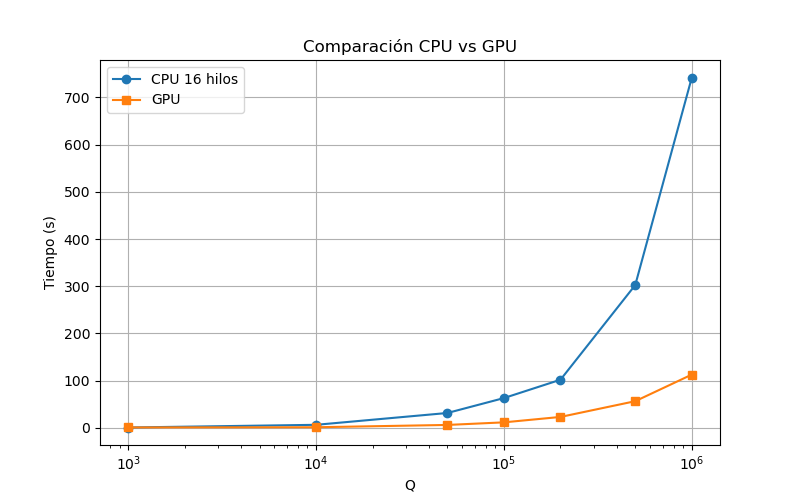

# Práctica Dirigida 01

### Grupo 10
- Nicole Arenas Lazo
- Edgard Inga Quillas
- Winston Flores Quispe

# 1. Cálculo de FLOPs del algoritmo KNN

En KNN, cada consulta debe compararse contra todas las muestras de entrenamiento utilizando distancia euclidiana.

Datos:

- \(N = 100000\)
- \(d = 64\)
- \(Q \in \{1000,10000,50000,100000,200000,500000,1000000\}\)

La distancia euclidiana realiza por cada dimensión:

- 1 resta
- 1 multiplicación
- 1 suma

Entonces:

\[
3 \text{ FLOPs por dimensión}
\]

Como:

\[
d=64
\]

se obtiene:

\[
FLOPs_{comparacion}=3 \times 64 = 192
\]

El trabajo total del algoritmo es:

\[
Ts = Q \times N \times 192
\]

---

## Para Q = 1000

\[
Ts = 1000 \times 100000 \times 192
\]

\[
Ts = 19.2 \times 10^9
\]

Resultado:

\[
Ts \approx 19.2 \text{ GFLOPs}
\]

### Análisis

Para un valor pequeño de consultas, el trabajo computacional todavía es manejable. Sin embargo, incluso con Q pequeño, el número de operaciones sigue siendo bastante grande debido a que KNN compara cada consulta contra todas las muestras.

---

## Para Q = 1000000

\[
Ts = 1000000 \times 100000 \times 192
\]

\[
Ts = 1.92 \times 10^{13}
\]

Resultado:

\[
Ts \approx 19.2 \text{ TFLOPs}
\]

### Análisis

Cuando Q aumenta, el trabajo crece de forma lineal y rápidamente se vuelve muy costoso para CPU. En este escenario, el uso de GPU tiene más sentido porque puede procesar miles de consultas en paralelo.

---

# 2. Resident Blocks y Resident Threads

Datos:

\[
SM = 108
\]

Tabla proporcionada:

| TPB | blocksPerSM |
|---|---|
|128|16|
|256|8|
|512|4|
|1024|2|

Fórmulas:

\[
residentBlocks = SM \times blocksPerSM
\]

\[
residentThreads = residentBlocks \times TPB
\]

---

## TPB = 128

\[
residentBlocks = 108 \times 16 = 1728
\]

\[
residentThreads = 1728 \times 128 = 221184
\]

---

## TPB = 256

\[
residentBlocks = 108 \times 8 = 864
\]

\[
residentThreads = 864 \times 256 = 221184
\]

---

## TPB = 512

\[
residentBlocks = 108 \times 4 = 432
\]

\[
residentThreads = 432 \times 512 = 221184
\]

---

## TPB = 1024

\[
residentBlocks = 108 \times 2 = 216
\]

\[
residentThreads = 216 \times 1024 = 221184
\]

---

## Análisis

En todos los casos se llega al mismo máximo teórico de hilos residentes:

\[
221184
\]

Sin embargo, esto no significa que todos tengan el mismo rendimiento.

Cuando el tamaño de bloque es pequeño, la GPU puede manejar más bloques simultáneamente y ocultar mejor las latencias. En cambio, bloques muy grandes reducen la cantidad de bloques concurrentes y pueden generar menor eficiencia.

Por eso, aumentar el tamaño del bloque no garantiza automáticamente mejores tiempos.

---

# 3. Cálculo de Waves para TPB = 256

Para:

\[
TPB = 256
\]

Se tiene:

\[
residentBlocks = 864
\]

Fórmulas:

\[
blocksPerGrid = \left\lceil \frac{Q}{256} \right\rceil
\]

\[
waves = \left\lceil \frac{blocksPerGrid}{864} \right\rceil
\]

---

## Resultados

| Q | blocksPerGrid | waves |
|---|---|---|
|1000|4|1|
|10000|40|1|
|50000|196|1|
|100000|391|1|
|200000|782|1|
|500000|1954|3|
|1000000|3907|5|

---

## Análisis

Para valores pequeños de Q, la GPU se encuentra subutilizada porque la cantidad de bloques generados es muy pequeña comparada con la capacidad total de la GPU.

Cuando Q aumenta, la GPU empieza a utilizar mejor sus recursos hasta llegar a saturarse.

En los casos donde el número de bloques supera la capacidad residente, el trabajo debe ejecutarse por oleadas o waves. Esto ocurre para Q grandes como 500000 y 1000000.

---

# 4. Tiempo total GPU e Intensidad Aritmética

El tiempo total de GPU se divide en:

\[
T_{GPU,total}=T_{H2D}+T_{kernel}+T_{D2H}
\]

donde:

- \(T_{H2D}\): copia CPU → GPU
- \(T_{kernel}\): ejecución del kernel
- \(T_{D2H}\): copia GPU → CPU

---

## Análisis

No todo el tiempo corresponde al cálculo del kernel. Las transferencias de memoria también consumen tiempo y pueden afectar bastante el rendimiento total.

Por eso, al medir GPU no basta con medir solo el kernel.

---

## Intensidad Aritmética

La intensidad aritmética se define como:

\[
AI = \frac{FLOPs}{Bytes}
\]

El problema indica:

\[
Bytes = 8QNd
\]

y:

\[
FLOPs = 192QN
\]

Entonces:

\[
AI = \frac{192QN}{8QNd}
\]

Simplificando:

\[
AI = \frac{192}{8 \times 64}
\]

\[
AI = 0.375
\]

---

## Análisis

El valor obtenido es bajo, lo que significa que el algoritmo mueve muchos datos desde memoria comparado con la cantidad de operaciones matemáticas realizadas.

Por esta razón, KNN suele ser memory-bound. Es decir, el rendimiento depende más de la velocidad de acceso a memoria que de la capacidad de cálculo de la GPU.

---

# 5. Consumo Energético

La energía consumida por una ejecución se calcula mediante:

\[
E = P \times T
\]

donde:

* (E) es la energía consumida en Joules.
* (P) es la potencia promedio en Watts.
* (T) es el tiempo de ejecución en segundos.

También se calcula la energía por consulta:

\[
E_{consulta} = \frac{E}{Q}
\]

## Metodología

Para CPU se utilizó el script `test_cpu.slurm`. La configuración utilizada fue:

* Q = 100000
* N = 100000
* d = 64
* 16 hilos

Para GPU se utilizó el script `test_gpu.slurm`. La configuración utilizada fue:

* Q = 100000
* N = 100000
* d = 64
* TPB = 256

## Resultados obtenidos

| Plataforma          | Tiempo (s) | Potencia promedio (W) | Energía total (J) | Energía por consulta (J/query) | Consultas/Joule |
| ------------------- | ---------: | --------------------: | ----------------: | -----------------------------: | --------------: |
| CPU (16 hilos)      |      57.63 |                170.65 |           9833.87 |                        0.09834 |           10.17 |
| GPU (A100, TPB=256) |      13.26 |                 81.49 |           1080.58 |                        0.01081 |           92.54 |

## Análisis

La GPU completó la ejecución en menor tiempo y con un menor consumo de energía total que la CPU.

La energía por consulta fue de 0.09834 J/query para CPU y 0.01081 J/query para GPU.

Además, la GPU alcanzó 92.54 consultas por Joule, mientras que la CPU obtuvo 10.17 consultas por Joule.

Estos resultados muestran que la GPU es más eficiente energéticamente para este problema.

## Conclusión de la pregunta 5

La GPU obtuvo mejores tiempos de ejecución y una mejor eficiencia energética que la CPU. Para la carga evaluada, la GPU NVIDIA A100 procesó más consultas utilizando menos energía, siendo la alternativa más eficiente para ejecutar KNN.

# 6. Ejecución de KNN en CPU (Khipu)

El programa fue compilado y ejecutado en Khipu variando la cantidad de hilos de CPU para analizar el comportamiento del algoritmo KNN frente a diferentes tamaños de carga.

Se realizaron pruebas utilizando:

* (Q = {1000,10000,50000,100000,200000,500000,1000000})
* (N = 100000)
* (d = 64)

y configuraciones de:

* 2 hilos
* 4 hilos
* 8 hilos
* 16 hilos

## Resultados obtenidos

|       Q | 2 hilos (s) | 4 hilos (s) | 8 hilos (s) | 16 hilos (s) |
| ------: | ----------: | ----------: | ----------: | -----------: |
|    1000 |     8.90069 |      1.6996 |    0.886852 |      0.70409 |
|   10000 |     88.9805 |     16.9745 |     8.92887 |       6.3868 |
|   50000 |     447.931 |      84.977 |     44.3732 |      31.4465 |
|  100000 |     612.425 |     169.901 |     97.9069 |      63.0683 |
|  200000 |     1245.36 |     340.256 |     184.244 |      101.957 |
|  500000 |           — |     1014.19 |     483.566 |      302.569 |
| 1000000 |           — |           — |           — |      742.326 |

Los valores marcados con "—" corresponden a ejecuciones no disponibles durante el periodo de experimentación debido al elevado tiempo requerido para completar las pruebas.

## a) Tiempo de ejecución vs hilos



### Análisis

Se observa que al aumentar la cantidad de hilos disminuye el tiempo de ejecución del algoritmo.

La reducción del tiempo es visible para todos los valores de Q evaluados, lo que indica que el problema puede aprovechar el paralelismo disponible para procesar más consultas en menor tiempo.

## b) Tiempo por consulta (T/Q) vs Q

El tiempo por consulta se calcula mediante:

\[
T/Q=\frac{Tiempo}{Q}
\]



### Resultados aproximados

#### 2 hilos

|      Q |      T/Q |
| -----: | -------: |
|   1000 | 0.008901 |
|  10000 | 0.008898 |
|  50000 | 0.008959 |
| 100000 | 0.006124 |
| 200000 | 0.006227 |

#### 4 hilos

|      Q |      T/Q |
| -----: | -------: |
|   1000 | 0.001700 |
|  10000 | 0.001697 |
|  50000 | 0.001700 |
| 100000 | 0.001699 |
| 200000 | 0.001701 |
| 500000 | 0.002028 |

#### 8 hilos

|      Q |      T/Q |
| -----: | -------: |
|   1000 | 0.000887 |
|  10000 | 0.000893 |
|  50000 | 0.000887 |
| 100000 | 0.000979 |
| 200000 | 0.000921 |
| 500000 | 0.000967 |

#### 16 hilos

|       Q |      T/Q |
| ------: | -------: |
|    1000 | 0.000704 |
|   10000 | 0.000639 |
|   50000 | 0.000629 |
|  100000 | 0.000631 |
|  200000 | 0.000510 |
|  500000 | 0.000605 |
| 1000000 | 0.000742 |

### Análisis

El tiempo por consulta se mantiene relativamente estable para cada configuración de hilos, lo que indica un comportamiento aproximadamente lineal respecto al número de consultas.

La configuración de 16 hilos presenta los menores valores de T/Q para la mayoría de los casos evaluados.

## Configuración óptima observada

|       Q | Mejor configuración CPU |
| ------: | ----------------------- |
|    1000 | 16 hilos                |
|   10000 | 16 hilos                |
|   50000 | 16 hilos                |
|  100000 | 16 hilos                |
|  200000 | 16 hilos                |
|  500000 | 16 hilos                |
| 1000000 | 16 hilos                |

## Conclusión pregunta 6

La configuración de 16 hilos obtuvo los menores tiempos de ejecución para todos los valores de Q evaluados. Para cargas pequeñas la diferencia respecto a 8 hilos es menor, mientras que para cargas grandes el beneficio de utilizar más hilos es más evidente.

---

# 7. Ejecución de KNN en GPU (Khipu)

El programa KNN en GPU fue compilado utilizando CUDA y ejecutado en Khipu sobre una GPU NVIDIA A100-PCIE-40GB MIG 3g.20gb.

Se utilizó:

```bash
module load cuda/12.8
nvcc -O3 -arch=sm_80 knn_gpu_sm.cu -o knn_gpu_sm
sbatch run_gpu.slurm
```

Se realizaron pruebas utilizando:

* (Q = {1000,10000,50000,100000,200000,500000,1000000})
* (N = 100000)
* (d = 64)
* (TPB = {128,256,512,1024})

## Resultados obtenidos

|       Q | TPB óptimo | Tiempo GPU (s) |         T/Q |
| ------: | ---------: | -------------: | ----------: |
|    1000 |        128 |       0.788673 | 0.000788673 |
|   10000 |        256 |        1.23904 | 0.000123904 |
|   50000 |        256 |        6.13132 | 0.000122626 |
|  100000 |        128 |        11.6148 | 0.000116148 |
|  200000 |        128 |        23.0932 | 0.000115466 |
|  500000 |        128 |        56.4542 | 0.000112908 |
| 1000000 |        128 |        112.818 | 0.000112818 |

## a) Tiempo por consulta (T/Q) vs Q



### Análisis

Se observa que el tiempo por consulta disminuye conforme aumenta Q y tiende a estabilizarse para cargas grandes.

## b) Speedup GPU/CPU vs Q

Para la comparación se utilizó la mejor configuración CPU observada (16 hilos) y la mejor configuración GPU para cada caso.

|       Q | CPU 16 hilos (s) |  GPU (s) | Speedup |
| ------: | ---------------: | -------: | ------: |
|    1000 |          0.70409 | 0.788673 |    0.89 |
|   10000 |           6.3868 |  1.23904 |    5.15 |
|   50000 |          31.4465 |  6.13132 |    5.13 |
|  100000 |          63.0683 |  11.6148 |    5.43 |
|  200000 |          101.957 |  23.0932 |    4.42 |
|  500000 |          302.569 |  56.4542 |    5.36 |
| 1000000 |          742.326 |  112.818 |    6.58 |



### Análisis

El speedup aumenta conforme crece el tamaño del problema. Para valores pequeños de Q la diferencia entre CPU y GPU es reducida, mientras que para valores grandes la GPU obtiene ventajas significativas.

## Configuración óptima observada

|       Q | Mejor configuración GPU |
| ------: | ----------------------- |
|    1000 | TPB = 128               |
|   10000 | TPB = 256               |
|   50000 | TPB = 256               |
|  100000 | TPB = 128               |
|  200000 | TPB = 128               |
|  500000 | TPB = 128               |
| 1000000 | TPB = 128               |

## Conclusión pregunta 7

La configuración TPB = 128 obtuvo el mejor rendimiento para la mayoría de los casos evaluados, mientras que TPB = 256 presentó el mejor resultado para cargas intermedias.

---

# 8. Comparación CPU vs GPU

La comparación se realizó utilizando la mejor configuración CPU observada (16 hilos) y la mejor configuración GPU para cada valor de Q.

|       Q | CPU 16 hilos (s) |  GPU (s) |
| ------: | ---------------: | -------: |
|    1000 |          0.70409 | 0.788673 |
|   10000 |           6.3868 |  1.23904 |
|   50000 |          31.4465 |  6.13132 |
|  100000 |          63.0683 |  11.6148 |
|  200000 |          101.957 |  23.0932 |
|  500000 |          302.569 |  56.4542 |
| 1000000 |          742.326 |  112.818 |



## Análisis

Para valores pequeños de Q, CPU y GPU presentan tiempos similares. A medida que aumenta la cantidad de consultas, la GPU obtiene mejores tiempos de ejecución gracias a su mayor capacidad de paralelismo.

## Conclusión pregunta 8

La GPU muestra una mejor escalabilidad para cargas grandes, mientras que la CPU ofrece resultados competitivos para tamaños de problema pequeños.

---

# 9. Escalabilidad del algoritmo KNN

La escalabilidad mide la capacidad de un sistema para aprovechar recursos computacionales adicionales con el fin de reducir el tiempo de ejecución de una aplicación.

## Tabla resumen CPU/GPU

|       Q | CPU 2 hilos (s) | CPU 4 hilos (s) | CPU 8 hilos (s) | CPU 16 hilos (s) |  GPU (s) |
| ------: | --------------: | --------------: | --------------: | ---------------: | -------: |
|    1000 |         8.90069 |          1.6996 |        0.886852 |          0.70409 | 0.788673 |
|   10000 |         88.9805 |         16.9745 |         8.92887 |           6.3868 |  1.23904 |
|   50000 |         447.931 |          84.977 |         44.3732 |          31.4465 |  6.13132 |
|  100000 |         612.425 |         169.901 |         97.9069 |          63.0683 |  11.6148 |
|  200000 |         1245.36 |         340.256 |         184.244 |          101.957 |  23.0932 |
|  500000 |               — |         1014.19 |         483.566 |          302.569 |  56.4542 |
| 1000000 |               — |               — |               — |          742.326 |  112.818 |

## Ventajas y desventajas

### CPU

**Ventajas**

* Implementación más simple.
* Menor overhead para cargas pequeñas.
* Mayor flexibilidad para algoritmos complejos.

**Desventajas**

* Menor paralelismo disponible.
* Escalabilidad limitada por la cantidad de núcleos.

### GPU

**Ventajas**

* Paralelismo masivo.
* Mejor rendimiento para cargas grandes.
* Mejor eficiencia energética.

**Desventajas**

* Overhead de transferencia de memoria.
* Mayor complejidad de programación.

## Conclusión pregunta 9

La CPU mejora su rendimiento al incrementar la cantidad de hilos disponibles. Sin embargo, la GPU presenta una mejor escalabilidad para cargas grandes, obteniendo menores tiempos de ejecución y una mayor capacidad de procesamiento paralelo.
